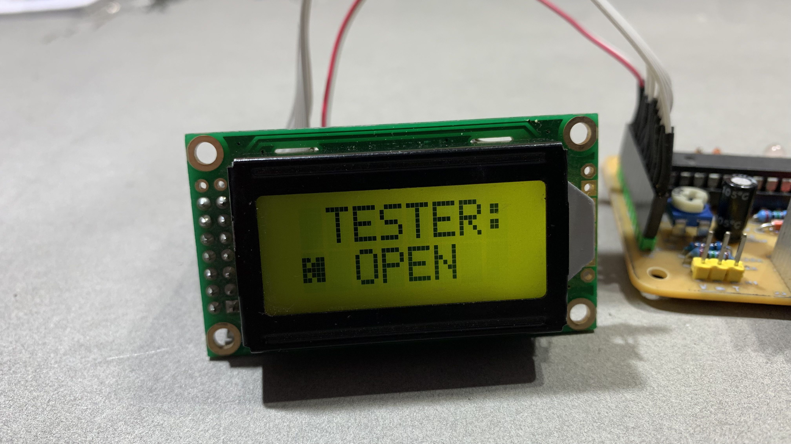
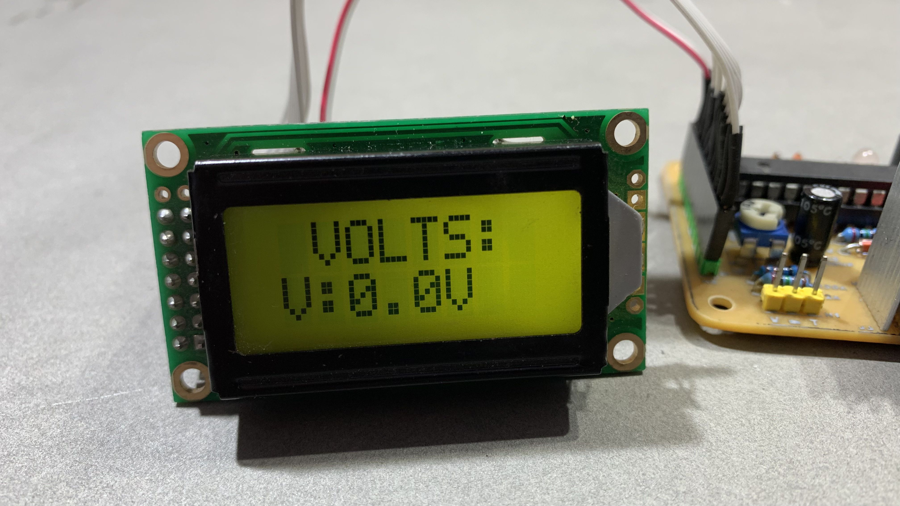

  

<h1 align="center">MKIT-Diode-Tester-DC-Voltmeter</h1>

📌 Voltmeter and diode test project with 2x8 LCD

  
  

  

    

      
    

    

      <strong style="font-size:20px;">🔴 Watch the Video 🔴</strong>
    

    

  

## 📝 Project Description

The **MKIT-Diode-Tester-DC-Voltmeter** is a simple embedded system built around the **ATmega8 microcontroller**.

It is designed to:
- 🔹 Measure DC voltage in the range of 0–30V
- 🔹 Perform basic diode testing with a **Good / Bad** indication

This project is intended for educational use, focusing on fundamental concepts of electronics and embedded systems design.
## ✨ Key Features
-  🔹⚡ DC Voltage Measurement: 0V to 30V range  
-  🔹🔍 Diode Testing: Quick GOOD / BAD detection  
-  🔹📟 Display: 2x8 Character LCD interface  
-  🔹🧠 Microcontroller: ATmega8 based system  
-  🔹🔌 Power Supply: 12V DC input  
-  🔹🛠️ Simple, low-cost and educational design  

## ⚙️ Project Details
| Parameter           | Specification              |
| :------------------ | :------------------------- |
| 🧠 Microcontroller   | ATmega8                    |
| 📟 Display           | 2x8 Character LCD          |
| ⚡ Input Voltage     | 0 – 30V DC                 |
| 🔍 Diode Test        | Good / Bad Detection       |
| 🔌 Supply Voltage    | 12V DC                     |
## 📦 Main Components

- 🔹 ATmega8 Microcontroller  
- 🔹 2x8 Character LCD Display  
- 🔹 Voltage Divider Circuit  
- 🔹 Diode Test Circuit  
- 🔹 12V DC Power Input  
- 🔹 Passive Components  
- 🔹 Crystal Oscillator (optional)

  
  &nbsp;&nbsp;
  
  &nbsp;&nbsp;
  
  &nbsp;&nbsp;
  
  &nbsp;&nbsp;
  

